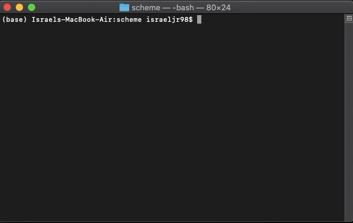

# A Scheme Interpreter

## 1. Introduction



Here we have an interpreter for the Scheme language, written entirely in Python. The central tenet of its design comes down to the concept of a Read-Evaluate-Print loop.

- **Read**: In this stage, the interpreter accepts a Scheme expression as input and proceeds to parse it into an equivalent Python representation (in this case, an instance of the <code>Pair</code> class).
- **Eval**: Short for 'Evaluate', this stage of the process takes the Python representation of the input expression and evaluates it in order to obtain values.

- **Print**: The final stage, where the string representation of the obtained value is printed out.

## 2. Core Concepts

The interpreter is capable of carrying out a subset of Scheme's functionality. This includes:

### Symbol evaluation

```lisp
scm> +
#[+]
scm> odd?
#[odd?]
scm> display
#[display]
```

### Calling built-in procedures

```lisp
scm> (+ 1 2)
3
scm> (* 3 4 (- 5 2) 1)
36
scm> (odd? 31)
True
```

### Defining simple variables

```lisp
scm> (define x 15)
x
scm> (define y (* 2 x))
y
scm> y
30
scm> (+ y (* y 2) 1)
91
scm> (define x 20)
x
scm> x
20
scm> (eval (define tau 6.28))
6.28
```

### Evaluating quoted expressions:

```lisp
scm> 'hello
hello
scm> '(1 . 2)
(1 . 2)
scm> '(1 (2 three . (4 . 5)))
(1 (2 three 4 . 5))
scm> (car '(a b))
a
scm> (eval (cons 'car '('(1 2))))
1
```

### Executing begin expressions

```lisp
scm> (begin (+ 2 3) (+ 5 6))
11
scm> (define x (begin (display 3) (newline) (+ 2 3)))
3
x
scm> (+ x 3)
8
scm> (begin (print 3) '(+ 2 3))
3
(+ 2 3)
```

- A begin expression is evaluated by evaluating all sub-expressions in order. The value of the begin expression is the value of the final sub-expression.

### Defining lambda expressions:

```lisp
scm> (lambda (x y) (+ x y))
(lambda (x y) (+ x y))
```

### Defining and calling user-defined procedures

```lisp
scm> (define f (lambda (x) (* x 2)))
f
```

It also accepts the shorthand form for defining named procedures:

```lisp
scm> (define (f x) (* x 2))
f
```

### Evaluation of special forms

A special form in Scheme is an expressions that operates almost exactly like a regular expression, except that they follow their own special rules for execution, such as short-circuiting before evaluating all the operands.

#### **if**

This function evaluates either the second (consequent) or third (alternative) expression of the `if` expression, depending on whether the value of the first (predicate) expression is true.

```lisp
scm> (if (= 4 2) 'a 'b)
b
scm> (if (= 4 4) (* 1 2) (+ 3 4))
2
```

It is legal to pass in just two expressions to the `if` special form. In this case, it returns the second expression if the first expression evaluates to a true value. Otherwise, it returns the special `okay` value, which represents an undefined value.

```lisp
scm> (if (= 4 2) 'a)
okay
```

#### **and**

The logical forms `and` is short-circuiting. For `and`, the interpreter evaluates each sub-expression from left to right, and if any of these evaluates to a false value, then `False` is returned. Otherwise, it should return the value of the last sub-expression. If there are no sub-expressions in an `and` expression, it evaluates to `True`.

```lisp
scm> (and)
True
scm> (and 4 5 6)  ; all operands are true values
6
scm> (and 4 5 (+ 3 3))
6
scm> (and True False 42 (/ 1 0))  ; short-circuiting behavior of and
False
```

#### **or**

For `or`, evaluate each sub-expression from left to right. If any sub-expression evaluates to a true value, it returns that value. Otherwise, it returns `False`. If there are no sub-expressions in an `or` expression, it evaluates to `False`. This one is also a short-circuting form.

```lisp
scm> (or)
False
scm> (or 5 2 1)  ; 5 is a true value
5
scm> (or False (- 1 1) 1)  ; 0 is a true value in Scheme
0
scm> (or 4 True (/ 1 0))  ; short-circuiting behavior of or
4
```

#### **cond**

`cond` form returns the value of the first result sub-expression corresponding to a true predicate, or the sub-expression corresponding to `else`.

```lisp
scm> (cond ((= 4 3) 'nope)
           ((= 4 4) 'hi)
           (else 'wait))
hi
scm> (cond ((= 4 3) 'wat)
           ((= 4 4))
           (else 'hm))
True
scm> (cond ((= 4 4) 'here (+ 40 2))
           (else 'wat 0))
42
```

The value of a `cond` is undefined if there are no true predicates and no `else`. In that case, it returns `okay`.

```lisp
scm> (cond (False 1) (False 2))
okay
```

#### **let**

The `let` special form binds symbols to values locally, giving them their initial values:

```lisp
scm> (define x 'hi)
x
scm> (define y 'bye)
y
scm> (let ((x 42)
           (y (* 5 10)))
       (list x y))
(42 50)
scm> (list x y)
(hi bye)
```

#### **mu**

A `mu` expression is similar to a `lambda` expression, except that the new frame's parent is the frame in which the mu is called, not the frame in which it was created.

```lisp
scm> (define f (mu (x) (+ x y)))
f
scm> (define g (lambda (x y) (f (+ x x))))
g
scm> (g 3 7)
13
```

## 3. Data Types

The following provides a breakdown on the different data types that exist in this interpreter and their equivalent representation in Python.

| **Scheme Data Type**  | **Python Representation**                        |
| --------------------- | ------------------------------------------------ |
| Numbers               | Python's built-in `int` and `float` data types.  |
| Symbols               | Python's built-in `string` data type.            |
| Booleans (`#t`, `#f`) | Python's built-in `True`, `False` values.        |
| Pairs                 | The `Pair` class, defined in `scheme_reader.py`. |
| `nil`                 | The `nil` object, defined in `scheme_reader.py`. |

## 4. Running the Scheme Interpreter

To run this program, type the following into the Terminal:

```sh
$ python3 scheme.py
```

To exit, press `Ctrl-d` or evaluate the `exit` procedure:

```lisp
scm> (exit)
```
